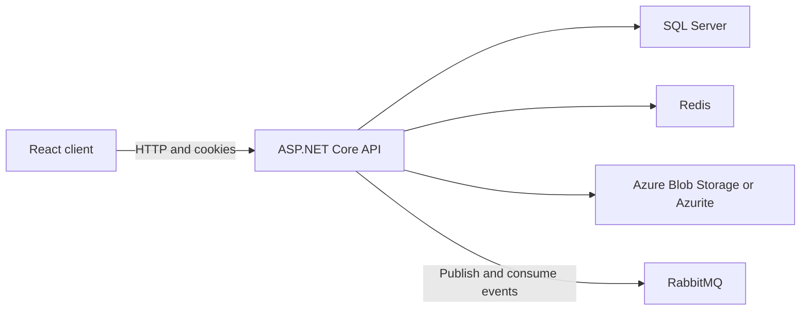

# Pursuit

[](https://github.com/adheebabdulla007/pursuit/actions/workflows/ci.yml)

Pursuit is a multi-tenant job board built with ASP.NET Core 10 and React 19. Employers can post jobs, job seekers can search and apply with a resume, and administrators can manage accounts.

I built the project to practise the parts of backend work that become difficult after the first CRUD screen: tenant boundaries, session revocation, concurrent refresh requests, browser security, caching, messaging, and repeatable tests.

## Try it locally

You need Docker Desktop with Docker Compose.

```powershell
Copy-Item .env.example .env
docker compose up --build -d --wait
```

Open [http://localhost:5173](http://localhost:5173). The local administrator account is documented in [the demo guide](docs/demo-guide.md).

Stop the stack with:

```powershell
docker compose down
```

Use `docker compose down -v` when you also want to delete the local SQL Server volume.

## What works

- Employer and job-seeker registration with role-specific validation
- Job creation, editing, deletion, search, and offset pagination
- Resume upload to Azure Blob Storage or Azurite
- Application submission with a database uniqueness constraint
- Administrator statistics, user paging, and account activation controls
- JWT access tokens plus rotating refresh tokens stored in HttpOnly cookies
- Refresh-token replay detection and account-wide session revocation
- CSRF protection for cookie-authenticated browser mutations
- Tenant-aware query filters and service-level ownership checks
- Redis-backed job search caching with cache invalidation
- RabbitMQ application-submitted events and a background consumer
- Production startup configuration checks and opt-in administrator bootstrap

## Architecture



The API follows a four-project structure:

- `Pursuit.Domain`: entities and enums
- `Pursuit.Application`: use cases, DTOs, validation, and interfaces
- `Pursuit.Infrastructure`: EF Core, Redis, RabbitMQ, identity, and blob storage
- `Pursuit.API`: controllers, authentication, middleware, and composition root

Read [the architecture notes](docs/architecture.md) for request flows, trust boundaries, design decisions, and current failure modes.

## Security work

The repository includes tested fixes for several easy-to-miss authentication problems:

- Public registration accepts only `Employer` and `JobSeeker`; numeric enum values and `Admin` are rejected.
- A refresh token is rotated inside a SQL transaction with row-level locking.
- Reuse of a rotated refresh token revokes every refresh token for that account.
- Access tokens carry a security version. Deactivation and password-sensitive account changes invalidate existing sessions.
- Browser mutations require an antiforgery token and an allowed origin.
- Production startup rejects missing secrets, weak signing keys, unencrypted SQL connections, RabbitMQ guest credentials, and emulator blob storage.

The implementation notes live in [`docs/`](docs/).

## Verification

The GitHub Actions workflow runs three jobs on every push and pull request:

| Job | Checks |
| --- | --- |
| Backend | Release build and 51 SQL Server, Redis, RabbitMQ, API, and configuration tests |
| Frontend | ESLint, 47 Vitest component tests, and a production build |
| Browser | Playwright employer-to-job-seeker journey across Chromium, Firefox, and WebKit |

Run the same build and test gates locally:

```powershell
dotnet restore Pursuit.slnx
dotnet build Pursuit.slnx --configuration Release --no-restore
dotnet test Pursuit.slnx --configuration Release --no-build

Set-Location client
npm ci
npm run lint
npm test
npm run build
```

The backend test suite uses Testcontainers, so Docker must be running.

## Main technology choices

| Area | Choice |
| --- | --- |
| API | ASP.NET Core 10, C# 14 |
| Data | EF Core 10, SQL Server |
| Client | React 19, TypeScript 6, Vite 8, Tailwind CSS 4 |
| Cache | Redis |
| Messaging | RabbitMQ |
| Files | Azure Blob Storage, Azurite for local work |
| Tests | xUnit, Testcontainers, Vitest, Testing Library, Playwright |
| Delivery | Docker Compose and GitHub Actions |

## Repository map

```text
Pursuit/
├── src/                         API and backend projects
├── client/                      React client and browser tests
├── tests/Pursuit.IntegrationTests/
├── docs/                        Design and security notes
├── .github/workflows/ci.yml
├── docker-compose.yml           Complete local stack
└── docker-compose.e2e.yml       Browser-test dependencies
```

## Current limits

These are the next engineering tasks, recorded here so the repository does not claim more than it proves:

1. Application rows and RabbitMQ messages are written separately. A transactional outbox is planned to prevent lost notifications when the broker is unavailable.
2. EF Core migrations run during API startup. A migration bundle and one-time deployment job are planned for production rollout.
3. `/health` is a liveness endpoint. Dependency readiness checks still need to cover SQL Server, Redis, RabbitMQ, and Blob Storage.
4. API page sizes, search text, uploads, and request bodies need server-side bounds before public exposure.
5. Authentication and upload endpoints need rate limits backed by load-test results.
6. Job search uses SQL `Contains` and offset pagination. Larger data sets will need better indexes, keyset pagination, and a dedicated search strategy.

The order and reasoning are in [the portfolio roadmap](docs/portfolio-roadmap.md).

## Interview walkthrough

[The interview guide](docs/interview-guide.md) contains a five-minute code tour, the decisions I would discuss, and direct answers to likely follow-up questions.

## License

This project is available under the [MIT License](LICENSE).
