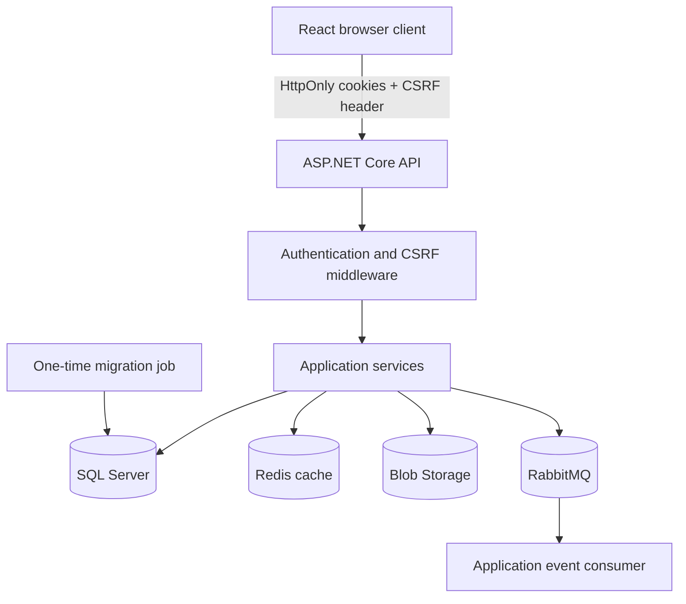
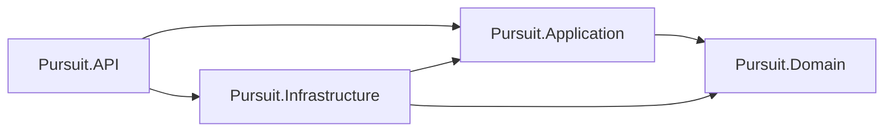
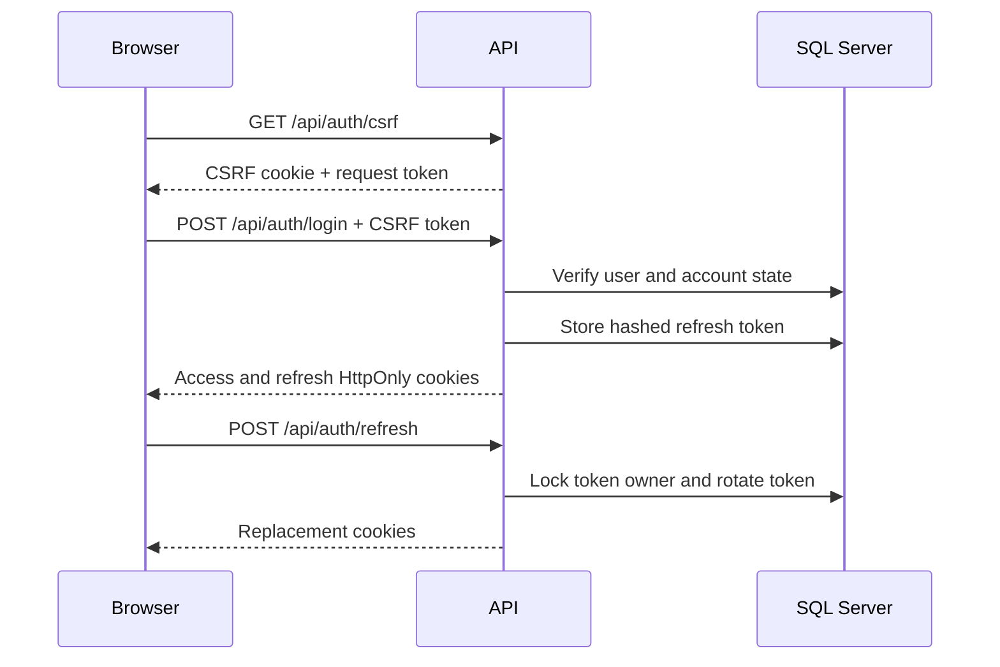
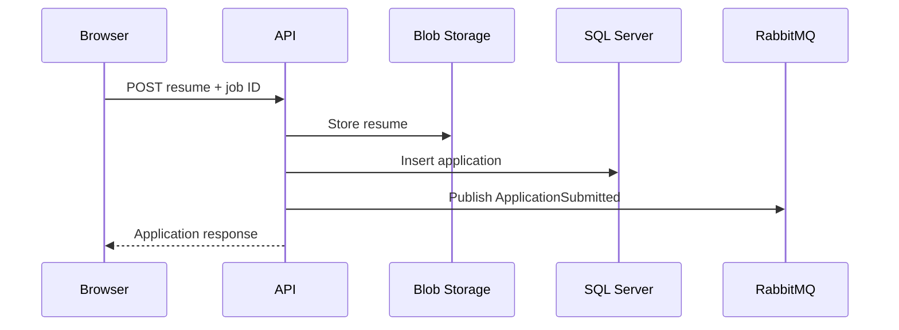

# Architecture notes

## System boundary

Pursuit is a modular monolith. One ASP.NET Core process owns the HTTP API and the RabbitMQ consumer. SQL Server is the source of truth. Redis holds disposable search results, Blob Storage holds resumes, and RabbitMQ carries application-submitted events.

This shape keeps deployment and debugging manageable for one developer. The project boundaries still make database, cache, messaging, and file-storage code replaceable without moving each concern into its own service.

## Backend project boundaries

`Pursuit.Domain` contains entities and enums. It has no dependency on ASP.NET Core, EF Core, or a message broker.

`Pursuit.Application` owns use cases and interfaces. Services receive repository, cache, storage, and publisher interfaces through dependency injection.

`Pursuit.Infrastructure` implements those interfaces with EF Core, SQL Server, Redis, RabbitMQ, BCrypt, and Azure Blob Storage.

`Pursuit.API` is the composition root. It configures authentication, CORS, antiforgery protection, middleware, controllers, and startup checks.

## Authentication flow

Access tokens live for at most 15 minutes and carry the user role, tenant ID, and security version. Each authenticated request checks those claims against current account state. Deactivating a user or tenant therefore blocks an otherwise valid token.

Refresh tokens are random values. SQL Server stores only their SHA-256 hashes. Rotation runs under a database transaction and locks the user row, which stops two requests from successfully rotating the same session at once. Reuse of an old token revokes all refresh tokens for that user.

## Tenant boundary

Employer users belong to a tenant. Jobs and applications carry a tenant ID. The current tenant comes from validated identity claims.

The boundary is enforced in two places:

1. EF Core query filters restrict ordinary tenant-scoped queries.
2. Application services check ownership before writes and sensitive reads.

Authentication and administrator queries use narrow `IgnoreQueryFilters` paths because they must locate users before a tenant context exists. Those calls live in named repository methods so a code review can find them.

## Job search and cache

The API builds a cache key from the search filters and page values. A cache miss executes the SQL query and stores the result with a time limit. Job writes clear matching cache keys.

Redis failure is treated as a cache miss. The SQL database remains authoritative, and cache exceptions are logged rather than returned to the browser.

Current SQL search uses `Contains` and offset pagination. This is reasonable for the demo data. The planned data-growth work covers input bounds, supporting indexes, keyset pagination, and a search engine or SQL full-text search if measurements justify it.

## Application submission

SQL Server has a unique index on `(JobId, ApplicantId)`, so concurrent requests cannot create duplicate applications.

There is one known consistency gap. The SQL insert commits before RabbitMQ publication. A broker failure can leave a saved application without a notification and return an error to the browser. The next backend milestone is a transactional outbox: write the application and event in one SQL transaction, then publish the stored event from a retrying worker.

## Startup and deployment

Startup validates required settings before administrator creation or hosted consumers run. Production rejects development credentials and insecure SQL or Blob settings. Data Protection keys must live in a shared directory when multiple instances serve browser requests.

CI builds a Linux EF Core migration bundle and verifies it against empty and current databases. A one-time deployment job runs that bundle before API rollout. The normal API process never calls `MigrateAsync`, so replicas can use a database identity without schema-alteration permissions. A failed migration exits non-zero and blocks dependent API startup in Docker Compose.

## Failure behavior

| Dependency | Current behavior |
| --- | --- |
| SQL Server | Migration job blocks rollout; an API request fails if connectivity is lost after deployment |
| Redis | Cache operations log the error and fall back to SQL |
| RabbitMQ at startup | Consumer retries with increasing delays |
| RabbitMQ during publish | Application record may already be committed; transactional outbox is planned |
| Blob Storage | Resume upload or download fails |
| Data Protection key ring | Production startup fails when the configured directory is missing |

`/health` currently proves that the process can answer HTTP. Separate readiness checks for required dependencies are still planned.

## Why a modular monolith

The job board has one small team and one transactional data model. A modular monolith keeps local setup, transactions, tests, and deployment easier to reason about. Redis, RabbitMQ, and Blob Storage still provide concrete examples of external dependency handling.

Service extraction would make sense when a boundary needs independent ownership, release timing, or load characteristics. Splitting the current code into services before those pressures appear would add network and operational failure modes without solving a measured problem.
